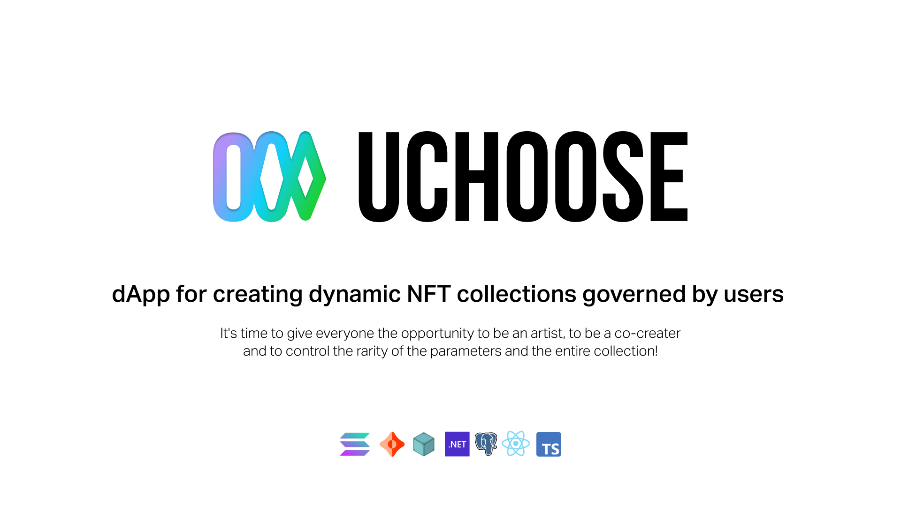



## ❓ About

**Uchoose** is a dApp that allows artists to create programmatically generated collections without writing any code.

Artists can initiate and upload the set of parameters which would be used for NFT generation in the collection.

Moreover, with the help of our dApp buyers control the appearance of the created NFT and release it by choosing its parameters from a set (the new NFT generated only after the purchase of the previous one in collection).

## 🚀 Roadmap

### 4Q 2021:

- [ ] 🌎 Community Expansion
- [ ] 🔎 Integration with marketplaces
- [ ] 🌐 Add other popular networks
- [ ] 👪 Increase our team
- [ ] 🌅 Release Beta

### 1Q 2022:

- [ ] 🥇 Build our own marketplace
- [ ] 💰 Emission our utility solana token
- [ ] 👪 Increase our team
- [ ] 🌎 Community Expansion
- [ ] 🎨 Upgrade UI/UX design
- [ ] ⚡ Create **UCHOOSE** brand collection and give every member to be a co-creator

### 2Q 2022:

- [ ] 🔓 Release our API
- [ ] 💣 Integration with GameFi projects
- [ ] 📧 Offering major brands to create NFT collections and attract their audience to be co-creators

## 🌎 Community

    <b>Follow us in</b>

- [Discord](https://discord.gg/GfkjTCWqkF)
- [Telegram](https://t.me/joinchat/pBFoUc5KvVNiODRi)
- [Twitter](https://twitter.com/UChoose_NFT)
- [Facebook](https://www.facebook.com/profile.php?id=100073270212425)
- [Instagram](https://www.instagram.com/uchoose_nft/)

## ❗ License

> Copyright © Life Loop, 2021. All rights reserved.
> The Application under the Commercial license. See [LICENSE](LICENSE.md) file for full license information.