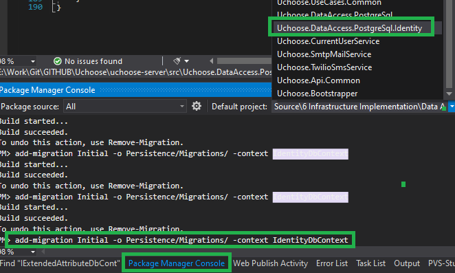
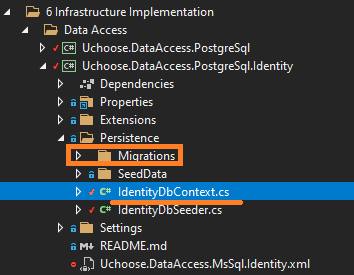

# ћиграции базы данных PosgreSQL

ƒл€ того, что добавить новую миграцию в Ѕƒ, необходимо:
1. ќткрыть окно `Package Manager Console` (`View`->`Other Windows`->`Package Manager Console`);
1. ¬ыбрать в качестве проекта по умолчанию тот проект, в котором находитс€ контекст доступа к данным, через который хотим добавить новую миграцию;
1. ¬ыполнить команду с соответствующим контекстом:
```
add-migration Initial -o Persistence/Migrations/ -context IdentityDbContext
```



> ѕри разработке предрелизных версий допускаетс€ при добавлении новых изменений не создавать новые миграции, а удал€ть весь каталог `Persistence/Migrations/` и занового создавать `Initial` миграцию, так как в процессе разработки модель Ѕƒ может часто мен€тьс€.

